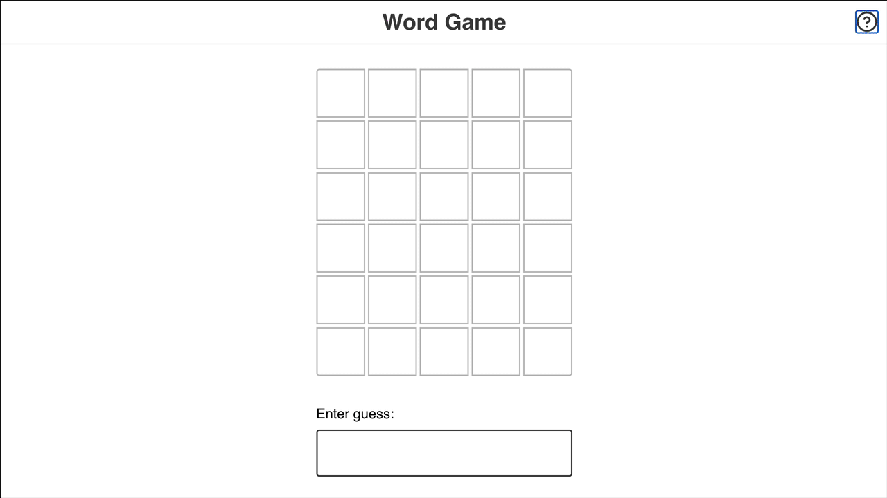

<div align="center">
  

  # Wordle

  **Six guesses. Five letters. One word.**

  A colorful Wordle-inspired game built with React and Parcel.
</div>



## ✨ Highlights

- 🟩 Color-coded clues for correct, misplaced, and incorrect letters
- 🎲 A randomly selected word for every new game
- 🔁 Instant replay after a win or loss
- 🌗 A light and dark theme that remembers your preference

## 🎮 How to play

Enter a five-letter word and use the tile colors to plan your next guess:

| Tile | Meaning |
| --- | --- |
| 🟩 Green | The letter is correct and in the right position |
| 🟨 Yellow | The letter is in the word but in a different position |
| ⬛ Gray | The letter is not in the word |

Solve the word before all six rows are filled to win the round.

## 🛠️ Local development

### Prerequisites

- [Node.js](https://nodejs.org/) with npm
- [Git](https://git-scm.com/)

### Get running

```sh
git clone https://github.com/heyitsaamir/wordle-project.git
cd wordle-project
npm ci
npm run dev
```

Parcel prints the local URL in the terminal and reloads the page whenever a
source file changes.

### Create a production build

```sh
npm run build
```

The optimized output is written to `dist/`.

## 📜 Available scripts

| Command | Purpose |
| --- | --- |
| `npm run dev` | Clear previous Parcel output and start the development server |
| `npm run build` | Create an optimized production build |

---

<div align="center">
  Made for word lovers, puzzle solvers, and ambitious first guesses.
</div>
